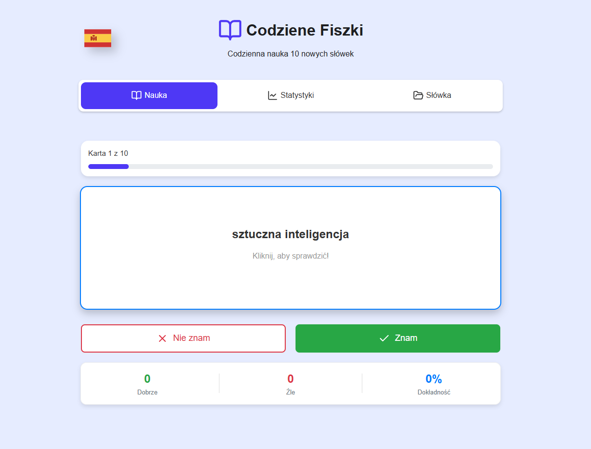
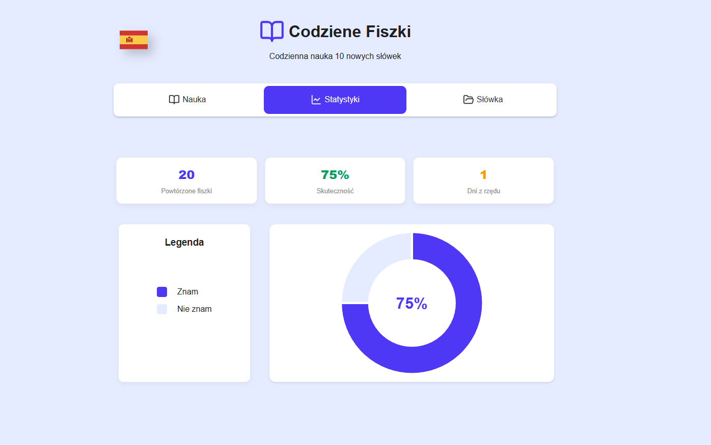

# Podziękowania
> Cały styl dokumentacji został pożyczony od [@Teczak-dev](https://github.com/Teczak-dev) (za nieprzymuszoną jego zgodą)

## Krótki opis
Moja aplikacja codziennie generuje zestaw 10 fiszek, identyczny dla wszystkich użytkowników: 8 łatwych oraz 2 trudne. Użytkownik może przeglądać swoje statystyki, a także – jeśli chce – zobaczyć pełną listę dostępnych fiszek. Aplikacja wspiera naukę dwóch języków: hiszpańskiego oraz angielskiego.

## Live demo
- [Link do live demo ->](https://fiszkireact.infinityfree.me/)

## Screenshots



## Video demo
[Demo](https://youtu.be/mU6r3AmY8_A) 

## Funkcjonalności
- Strona: nauka - pasek postępu, fiszki, statystyki
- Strona: statystyki - ogolne statystki (zapis do localStorage), wykres
- Strona: słowka - zbior wszystkich fiszek, wyszukiwarka
- Responsywnosc
- Wybor jezyka do nauki (angielski / hiszpanski), zapis do localStorage

### Krótki przewodnik po frontendzie aplikacji FitTrack.

## Szybki start
1. Sklonuj repozytorium
```bash
git clone https://github.com/NokielCB/flashcard.git
cd flashcard
```
2. Zainstaluj zależności
```bash
npm install
```
3. Uruchom w trybie deweloperskim
```bash
npm run dev
```
4. Otwórz w przeglądarce (Vite poda URL, zwykle `http://localhost:5173`)

## Budowanie produkcyjne
```bash
npm run build
npm run preview
```

## Konfiguracja
- Projekt nie wymaga kluczy API w tym repo, API jest prywatnym projektem, dostęp do backendu możliwy po kontakcie prywatnym, jeżeli masz własne API to zmień lokalizację w vite.config.ts 

- Wyjasnienie endpointów API znajdują się w [docs/api.md](./docs/api.md)

## Struktura projektu (krótko)
- `src/` — kod źródłowy
  - `components/` — atoms/molecules/organisms/templates
  - `context/` —  (`LanguageContext.jsx`)
  - `hooks/` — custom hook (`useDailyWords.js`)
  - `pages/` — strony aplikacji (np. `Study.jsx`)

## Biblioteki

- `d3` - dodaje wykres kołowy dla statystyk
- `lucide` - specjalnie ikony svg
- `country-flag-icons` ^1.6.4 - ikony flag na komputerach

## Known issues
Po odświeżeniu strony na /stats lub /words strona się wywala. Znam rozwiązania jednak brak czasu na jego wdrożęnie 

## Q&A
#### Co sprawiło największe problemy i jak je rozwiązałeś?
Wszystko, a pomógł mi [@Teczak-dev](https://github.com/Teczak-dev)

## 👨‍💻 Autor

**Jakub Nokielski**

